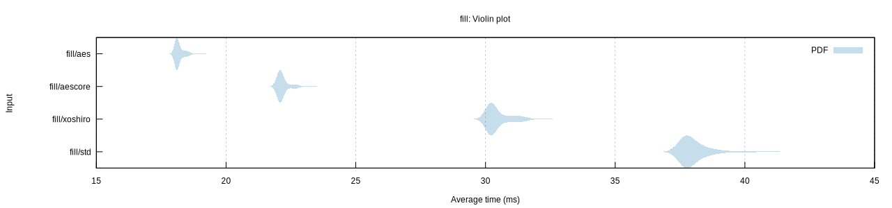

THE SOFTWARE IS PROVIDED "AS IS" AND VINZENT STEINBERG AND THE AUTHORS DISCLAIM
ALL WARRANTIES WITH REGARD TO THIS SOFTWARE INCLUDING ALL IMPLIED WARRANTIES OF
MERCHANTABILITY AND FITNESS. IN NO EVENT SHALL VINZENT STEINBERG OR THE AUTHORS
BE LIABLE FOR ANY SPECIAL, DIRECT, INDIRECT, OR CONSEQUENTIAL DAMAGES OR ANY
DAMAGES WHATSOEVER RESULTING FROM LOSS OF USE, DATA OR PROFITS, WHETHER IN AN
ACTION OF CONTRACT, NEGLIGENCE OR OTHER TORTIOUS ACTION, ARISING OUT OF OR IN
CONNECTION WITH THE USE OR PERFORMANCE OF THIS SOFTWARE.


# aesrng

Rust port of https://github.com/jedisct1/aes-stream.


## Compilation

This crate requires a CPU supporting the AES-NI instructions. To allow Rust to
use these instructions, the following flags are recommended:

```
RUSTFLAGS='-C target-feature=+aes -C target-cpu=native'
```

This only works with a nightly version of Rust.


## Performance

Performance is comparable to the fastest non-crypto RNGs:


